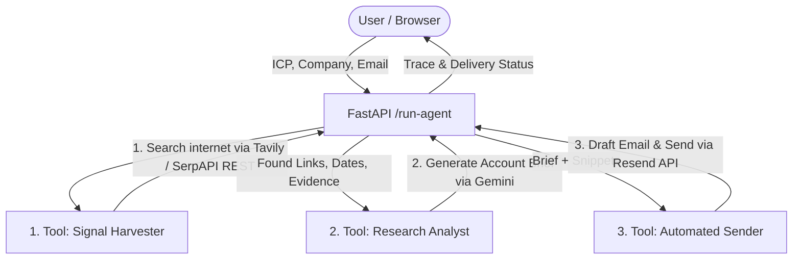

# FireReach - Application Documentation

## 1. Project Overview
FireReach is an autonomous outreach agent running in full production-ready mode. It chains perfectly ordered function calls to capture real-time B2B buyer signals from live search (Tavily/SerpAPI), perform analytical research (Gemini), and execute highly personalized outreach securely via Resend. The critical architecture forces its strict pipeline: Harvester → Analyst → Sender.

## 2. Architecture Diagram

## 3. Logic Flow: Signal → Research → Send
1. **Signal Harvester (Live)**: Queries Tavily or SerpAPI REST APIs to actively search for funding, hiring, or leadership shifts over the last 90 days. Utilizes deterministic extraction—resolving direct source URLs and filtering irrelevant news. No LLM hallucination occurs here.
2. **Research Analyst (Gemini)**: Reads the `icp` and the verified structured `signals`. Instructs Gemini (Temperature=0.1) to construct a 2-paragraph Account Brief strictly bound to the JSON objects surfaced by Tool 1.
3. **Automated Sender (Gemini + Resend)**: Drafts an un-templated email referencing the exact signals. Directly invokes the Resend SDK. Checks response for explicit API IDs and maps exact error reasons if the dispatch fails.
*Safeguards*: The orchestrator checks if signals are empty; if so, aborts early without ever hitting Gemini to save resources and prevent spam.

## 4. Signal Grounding Explanation
The agent enforces strict alignment and prevents hallucination through:
1. Pure REST Search: The Signal Harvester is deterministic Python code analyzing text responses from internet search engines for keyword matching (unlike zero-shot models trying to guess historical facts).
2. Forced URL attribution: Each signal has `source_url` defined in Pydantic.
3. Low temperatures (0.1, 0.3) in the Research and Sender LLM phases.
4. Strict system prompting specifically prohibiting LLMs from making up external variables outside the attached signals.

## 5. Tool Schemas
See `backend/schemas.py` for exact specifications. Highlights include the addition of `provider_response` (recording internal dispatch state) and `DiagnosticsResponse` (relaying UI status of local environment configs).

## 6. Setup Instructions
1. Install Python 3.9+ and Node 18+.
2. Navigate to `/backend`. Create `venv`, inside run `pip install -r requirements.txt`.
3. Set your 5 environment keys in `.env` (`GEMINI_API_KEY`, `RESEND_API_KEY`, `RESEND_FROM_EMAIL`, `SERPAPI_KEY`, `TAVILY_API_KEY`).
4. Start App: `uvicorn main:app --reload`
5. Navigate to `/frontend`. Run `npm install` and `npm run dev`.

The UI will query `http://localhost:8000/api/diagnostics` to illuminate the top-right pills green if your `.env` is properly established.

## 7. Limitations and Future Improvements
- Internet search relies on search engine snippets. Using a full scraping mechanism like Jina or Firecrawl could produce deeper account briefs by evaluating full pages.
- Memory: Currently one-shot logic per hit. A persistence layer (SQLite/Postgres) could map Outreach history and prevent double-emailing a target company.
